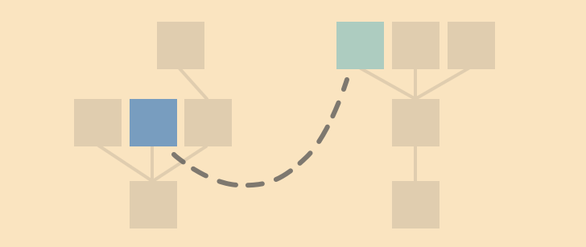

# hammock [](https://travis-ci.org/shaunlebron/hammock)

a cljs library that helps you transform one tree into another and to remember related branches.



In UIs, it is common to transform JSON data received from a backend REST
service into data better suited for representation on screen.  After this
transformation is made, it is useful to remember which original fields are
associated with the new ones (e.g. for highlighting invalid UI fields based on
backend-validated JSON fields)

This is an experiment to capture that relationship during the actual process of
transformation, by performing the transformation with objects we are calling
"hammocks."

Hammocks are a bit like [Om cursors], except they are anchored to two separate
trees: a read-only "source" tree and write-only "destination" tree. These
anchor points on the hammock move along their respective trees as data is
transformed from source to destination.  A log of the anchor positions is kept
for each transformation in order to remember the relationship between source
and destination branches.

## Usage

Add to your dependencies vector in project.clj:

```
[hammock "0.2.2"]
```

```clj
(ns example
 (:require [hammock.core :as hm]))
```

## Transforms and Mappings

Suppose you have data in some source format:

```clj
{:foo 1
 :bar 2}
```

And you want to transform it into some destination format:

```clj
{:my-foo {:value 1}
 :my-bar {:value 2}}
```

Also, you want to remember the mapping between the two formats:

```
SRC-KEYS        DST-KEYS
----------------------------------
[:foo]  <--->  [:my-foo :value]
[:bar]  <--->  [:my-bar :value]
```

Well sometimes a destination value can depend on multiple source values:

```clj
{:my-foo {:value 1}
 :my-bar {:value 2}
 :sum    {:value 3}} ;; <--- foo + bar
```

So a source->destination mapping would now look like:

```
SRC-KEYS       DST-KEYS
----------------------------------------
[:foo]  ---->  [:my-foo :value]
               [:sum    :value]
[:bar]  ---->  [:my-bar :value]
               [:sum    :value]
```

And a destination->source mapping would look like:

```
DST-KEYS                 SRC-KEYS
------------------------------------------
[:my-foo :value]  ---->  [:foo]
[:my-bar :value]  ---->  [:bar]
[:sum    :value]  ---->  [:foo]
                         [:bar]
```

## Using hammock

The following examples can be run from a REPL:

```
$ ./scripts/compile_cljsc   # one-time only
$ ./scripts/repl

cljs.user> (require '[hammock.core :as hm])
```

Create a hammock `h` to transform a source tree `src`:

```clj
(def src {:foo 1 :bar 2})
(def h (hm/create src))
```

Use `hm/copy!` to perform simple copies to the destination tree using the given
destination and source keys.  (They can be a keyword or a vector of keywords)


```clj
;;          DST-KEY          SRC-KEY
(hm/copy! h [:my-foo :value] :foo)
(hm/copy! h [:my-bar :value] :bar)
```

And use `hm/result` to get the transformed destination tree:

```clj
(def dst (hm/result h))
;; => {:my-foo {:value 1}
;;     :my-bar {:value 2}}
```

The `:anchors` metadata on the result will remember the forward/inverse
mappings of the keys between the formats. (Notice the keys are normalized
to vectors of keywords)

```clj
(-> dst meta :anchors :forward)
;;     SRC-KEYS   DST-KEYS
;; => {[:foo]   #{[:my-foo :value]}
;;     [:bar]   #{[:my-bar :value]}}

(-> dst meta :anchors :inverse)
;;     DST-KEYS            SRC-KEYS
;; => {[:my-foo :value]  #{[:foo]}
;;     [:my-bar :value]  #{[:bar]}}
```

### Manual writing

There is a command for manually setting a destination value, which is useful
for computing destination value from multiple source values.

```clj
(def sum (+ (:foo src) (:bar src)))
(hm/man! h [:sum :value] sum)
```

You can include optional dependent source keys as the last argument so we can
trace those keys to our computed value:

```clj
(hm/man! h [:sum :value] sum [:foo :bar])
```

And the new result will reflect the addition:

```clj
(def dst (hm/result h))
;; => {:my-foo {:value 1}
;;     :my-bar {:value 2}
;;     :sum    {:value 3}}

(-> dst meta :anchors :forward)
;;     SRC-KEYS     DST-KEYS
;; => {[:foo]   #{[:my-foo :value]
;;                [:sum    :value]}
;;     [:bar]   #{[:my-bar :value]
;;                [:sum    :value]}}

(-> dst meta :anchors :inverse)
;;     DST-KEYS            SRC-KEYS
;; => {[:my-foo :value]  #{[:foo]}
;;     [:my-bar :value]  #{[:bar]}
;;     [:sum    :value]  #{[:foo]
;;                         [:bar]}}
```

### Composability

We can create composable transformations using functions that take a
hammock object `h`:

```clj
(defn unpack-thing [h]
  (hm/copy! h [:my-foo :value] :foo)
  (hm/copy! h [:my-bar :value] :bar))
```

We can then use this function to perform sub-transformations.  We do this by
passing the function to `hm/nest!`, causing it to receive a relative hammock
whose anchors are moved to the given keys.

```clj
(def src {:a {:foo 1 :bar 2}
          :b {:foo 3 :bar 4}})

(def h (hm/create src))

(hm/nest! h :my-a :a unpack-thing)
(hm/nest! h :my-b :b unpack-thing)

(hm/result h)
;; => {:my-a {:my-foo {:value 1}
;;            :my-bar {:value 2}}
;;     :my-b {:my-foo {:value 3}
;;            :my-bar {:value 4}}}
```

And we can update `unpack-thing` to manually create a sum value:

```clj
(defn unpack-thing [h]
  (hm/copy! h [:my-foo :value] :foo)
  (hm/copy! h [:my-bar :value] :bar)

  (let [sum (+ (:foo h) (:bar h))  ;; <-- NOTE: lookups on a hammock return source values
        keys-used [:foo :bar]]
    (hm/man! h [:sum :value] sum keys-used)))

(hm/nest! h :my-a :a unpack-thing)
(hm/nest! h :my-b :b unpack-thing)

(hm/result h)
;; => {:my-a {:my-foo {:value 1}
;;            :my-bar {:value 2}
;;            :sum    {:value 3}}  ;; <-- added sum
;;     :my-b {:my-foo {:value 3}
;;            :my-bar {:value 4}
;;            :sum    {:value 7}}} ;; <-- added sum
```

### Sequences

There is support for simple 1-to-1 vector transformations using `hm/map!`.

```clj
(def src {:vals [{:foo 1 :bar 2}
                 {:foo 3 :bar 4}]})

(def h (hm/create src))

(hm/map! h :my-vals :vals unpack-thing)

(def dst (hm/result h))
;; => {:my-vals [{:my-foo {:value 1}
;;                :my-bar {:value 2}
;;                :sum    {:value 3}}
;;               {:my-foo {:value 3}
;;                :my-bar {:value 4}
;;                :sum    {:value 7}}]}
```

You can see the resulting anchors below:

```clj
-> dst meta :anchors :forward)
;;     SRC-KEYS               DST-KEYS
;; => {[:vals 0 :foo]     #{[:my-vals 0 :my-foo :value]
;;                          [:my-vals 0 :sum    :value]}
;;     [:vals 0 :bar]     #{[:my-vals 0 :my-bar :value]
;;                          [:my-vals 0 :sum    :value]}
;;     [:vals 1 :foo]     #{[:my-vals 1 :my-foo :value]
;;                          [:my-vals 1 :sum    :value]}
;;     [:vals 1 :bar]     #{[:my-vals 1 :my-bar :value]
;;                          [:my-vals 1 :sum    :value]}}

(-> dst meta :anchors :inverse)
;;     DST-KEYS                        SRC-KEYS
;; => {[:my-vals 0 :my-foo :value]   #{[:vals 0 :foo]}
;;     [:my-vals 0 :my-bar :value]   #{[:vals 0 :bar]}
;;     [:my-vals 0 :sum    :value]   #{[:vals 0 :foo]
;;                                     [:vals 0 :bar]}
;;     [:my-vals 1 :my-foo :value]   #{[:vals 1 :foo]}
;;     [:my-vals 1 :my-bar :value]   #{[:vals 1 :bar]}
;;     [:my-vals 1 :sum    :value]   #{[:vals 1 :foo]
;;                                     [:vals 1 :bar]}}
```

## Running tests

```
$ lein cljsbuild test
```

## License

Copyright © 2014 Shaun Williams

Distributed under the Eclipse Public License either version 1.0 or any
later version.

[Om cursors]: https://github.com/swannodette/om/wiki/Cursors
